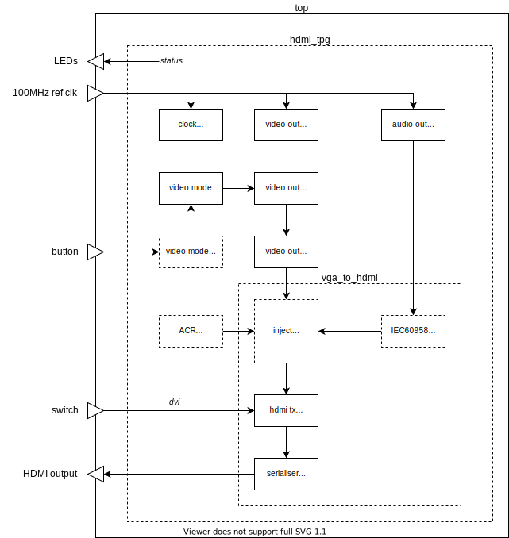

= hdmi_tpg

This design generates a video test pattern at resolutions from SD to full HD, and an audio test tone, for HDMI displays.

Note that the 1080p (1485Mbps) modes overclock the TMDS SelectIO outputs of the Xilinx 7-series FPGA.

== Getting Started

The following instructions apply to Windows 10, and require Xilinx Vivado and Vitis version 2020.1 or later to be installed.

To create the Vivado project, and build the FPGA bitstream:

. Open a Windows command prompt, and change directory to the location of the repository files.
. Run the `settings64` batch file from the Xilinx Vivado installation - if required - to set up your path for the Xilinx command line tools. For example:

  C:\> C:\Xilinx\Vivado\2020.1\settings64.bat

. Run the `xbuild` batch file, specifying the design name and board name as arguments, to create the Vivado project in the `xproj` directory, and to build an FPGA bitstream. The number of parallel jobs to be used during compilation by Vivado may also be specified on the command line; this defaults to 1 if not specified. For example:

  C:\> cd \work\tyto_project
  C:\work\tyto_project> xbuild.bat hdmi_tpg nexys_video 8

After the build process has completed, the Vivado project may be opened in the Vivado IDE.

To program the bitstream into a Nexys Video board:

. With the power off, connect the Nexys Video board's *PROG* port to the host PC and its *HDMI OUT* port to the monitor.
. Power on the Nexys Video board.
. Run the `xprog` batch file, specifying the design name and board name as arguments. For example:

  C:\work\tyto_project> xprog.bat hdmi_tpg nexys_video

The monitor should display the image shown in Figure 1 above.

The display mode is set by switches 3..0 as follows (0 = down, 1 = up):

    Mode  SW3..0      Description
    ====  ======   =================
     0     0000     640x480p60
     1     0001     720x480p60 4:3
     2     0010     720x480p60 16:9
     3     0011     1280x720p60
     4     0100     1920x1080i60
     5     0101     720x480i60 4:3
     6     0110     720x480i60 16:9
     7     0111     1920x1080p60
     8     1000     720x576p50 4:3
     9     1001     720x576p50 16:9
     10    1010     1280x720p50
     11    1011     1920x1080i50
     12    1100     720x576i50 4:3
     13    1101     720x576i50 16:9
     14    1110     1920x1080p50

The aspect ratio is signalled by AVI InfoFrames, but this does not work automatically with all HDTVs.

Switch 4 sets DVI mode (all HDMI enhancements to TMDS encoding are disabled, including audio).

LEDs 4..0 reflect the state of switches 4..0.

LEDs 7..5 should be on and steady, showing that the 3 MMCMs are locked (system, video and audio clocks).

== Design Description

The diagram below shows the main design blocks:

The modules shown are described below:

`top`:: A board specific wrapper around the main design.

`hdmi_tpg`:: The main design.

`clock_100m`:: An MMCM configured to generate a 100MHz system clock from a 100MHz reference.

`audio_out_test_tone`:: This module produces alternating test tones (A4 to the left channel, A3 to the right channel). The `audio_clock` module instantiated within it comprises an MMCM configured to generate 256 _Fs_ (12.288MHz) from the 100MHz reference clock, and a counter to generate an _Fs_ (48kHz) clock enable.

`hdmi_out`:: Top level of the HDMI output module.

`video_mode`:: Converts a 4-bit mode number into a full set of video timing parameters (sync, blank, active etc). The source data is containied in the `video_mode.xls` spreadsheet, which can be edited and converted to VHDL by saving it as CSV and then running the `video_mode.py` Python script.

`video_out_clock`:: An MMCM and associated buffers, and logic to dynamically reconfigure the MMCM to synthesise the pixel and serialiser clocks required by the current video mode.

`video_out_timing`:: Synthesises basic video timing.

`video_out_test_pattern`:: Generates the test pattern image (an array of vertical and horizontal lines, with colour bars.) Includes a table of reciprocals to smoothly scale the colour ramps in the centre of the image.

`hdmi_tx_pcm`:: Adds synchronisation and channel status per IEC60958 to a PCM sample stream.

`hdmi_tx_data_injector`:: Injects data islands, placed in the video blanking intervals. 2 packets are generated just after the beginning of horizontal sync every line for audio samples and audio clock regeneration (ACR). On the line just above the active area, an additional 2 packets are generated (audio and video InfoFrames). Packets that are not needed (e.g. because there are no audio samples to be transmitted at the time that the packet is being output) are stuffed with zeroes; these null packets are ignored by the sink.

`hdmi_tx_encoder`:: Uses the HDMI specification's recipe for TMDS encoding to create 10-bit TMDS/TERC4 symbols.

`tmds_tx_serialiser_selectio`:: Converts the 10-bit symbol stream from parallel to serial for each HDMI output channel, and is also used to generate a HDMI (pixel) clock. Drives out via SelectIO (TMDS differential) buffers.

== Simulation

A simulation of the top level (`tb_hdmi_tpg_nexys_video.vhd`) is provided as part of the Vivado project. The UUT is run for long enough to capture a full video frame in each of the 15 video modes. The video capture results are dumped in numbered BMP files. Data packets are extracted and may be inspected using the waveform viewer. Note that simulation run times are substantial.

++++

++++