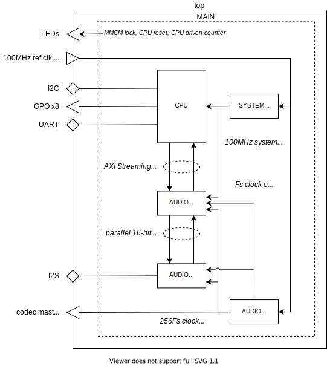
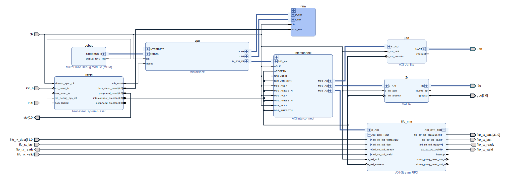
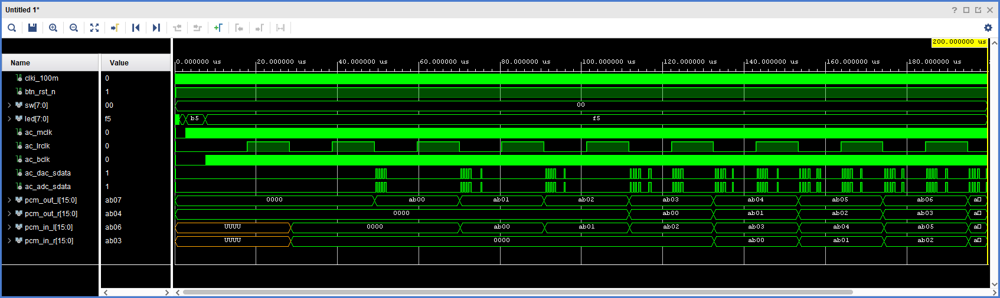

= mb_audio_io

This design demonstrates software driven digital processing of analogue audio via an I^2^S codec. C code running on a Microblaze CPU performs codec register initialisation and then applies a simple modulation effect to sampled audio in real time.

== Getting Started

The following instructions apply to Windows 10, and require Xilinx Vivado and Vitis version 2020.1 or later to be installed.

To create the Vivado and Vitis projects, and build the FPGA bitstream:

. Open a Windows command prompt, and change directory to the location of the repository files.
. Run the `settings64` batch file from the Xilinx Vitis installation - if required - to set up your path for the Xilinx command line tools. For example:

  C:\> C:\Xilinx\Vitis\2020.1\settings64.bat

. Run the `xbuild` batch file, specifying the design name and board name as arguments, to create Vivado and Vitis projects in the `xproj` directory, and to build an FPGA bitstream. The number of parallel jobs to be used during compilation by Vivado may also be specified on the command line; this defaults to 1 if not specified. For example:

  C:\> cd \work\tyto_project
  C:\work\tyto_project> xbuild.bat mb_audio_io nexys_video 8

After the build process has completed, the Vivado and Vitis projects may be opened in their respective IDEs.

To program the bitstream into a Nexys Video board:

. With the power off, connect the Nexys Video board's *PROG* and *UART* ports to the host PC, its *HPH OUT* port to headphones, and its *LINE IN* port to an audio source.
. Run a terminal emulator (e.g. TeraTerm) on the host PC, configured for 115200N81.
. Power on the Nexys Video board.
. Run the `xprog` batch file, specifying the design name and board name as arguments. For example:

  C:\work\tyto_project> xprog.bat mb_audio_io nexys_video

LEDs 5..7 should be on and steady, showing that the 2 MMCMs are locked and that the CPU is out of reset. LEDs 0..4 should show a binary count incrementing at 1Hz. The audio headphone output should be a modulated version of the audio line input.

== Design Description

The diagram below shows the main design blocks:

The modules shown are described below:

top:: A board specific wrapper around the main design.

MAIN:: The main design.

CPU:: Automatically generated wrapper for a Xilinx Block Diagram that contains the MicroBlaze CPU subsystem. Refer to the *MicroBlaze CPU Subsystem* section below for further details.

SYSTEM_CLOCK:: An MMCM configured to generate a 100MHz system clock from a 100MHz reference.

AUDIO_AXIS:: Bridges from the 100MHz AXI-Streaming ports of the MicroBlaze FIFOs to parallel (2 x 16 bit) PCM sample streams running at 48kHz.

AUDIO_I2S:: Converts audio samples from parallel to serial (I^2^S) and back again.

AUDIO_CLOCK:: An MMCM configured to generate 256 _Fs_ (12.288MHz) from 100MHz, and a counter to generate an _Fs_ (48kHz) clock enable.

=== MicroBlaze CPU Subsystem

The MicroBlaze CPU is instantiated within a Xilinx Block Diagram file:

The blocks are described below:

cpu:: MicroBlaze CPU, 32 bit, microcontroller preset, no caches.

ram:: 64kBytes for CPU instructions and data.

interconnect:: AXI interconnect to allow the CPU AXI master to connect to 3 AXI slaves.

gpio:: AXI GPIO IP core, configured for 2 channels: 8 outputs on the first channel, 8 inputs on the second.

uart:: "Lite" UART IP core, fixed at 115200N81, to provide console I/O (not used in this design).

i2c:: I^2^C bus master/slave controller IP core.

fifo_mm:: IP core providing a memory mapped (AXI Slave) interface to dual AXI-Streaming FIFOs (one in, one out).

rstctrl:: Reset controller IP core.

debug:: CPU debug controller IP core.

If you alter the block diagram in Vivado, you will need to export a TCL script to recreate by entering the following command in the TCL Console:

 write_bd_tcl -force -include_layout ../../../src/fpga/dsn/mb_audio_io/microblaze.tcl
 
To update the documentation, export an SVG image by entering the following command in the TCL Console:

 write_bd_layout ‑force ‑format svg ../../../doc/mb_audio_io/microblaze.svg

== MicroBlaze Software

The ADAU1761 codec registers are configured via I^2^C as follows:

* serial port: https://en.wikipedia.org/wiki/I%C2%B2S[I^2^S] mode
* record mixer: line in to L & R ADCs
* playback mixer: L & R DACs to headphone out
* slave mode (BCLK and LRCLK are inputs)
* 256Fs (12.288MHz) clocking direct from MCLK (PLL disabled)
* all other settings are default - see comments in `adau1761_p.h`

The application then loops forever, reading and writing samples, and applying a well known modulation effect.

Note that homebrew drivers have been used for the I^2^C and FIFO IP cores in place of the official drivers.

=== Source Files

`main.c`:: The top level of the application.

`axi_i2c.c`, `axi_i2c.h`, `axi_i2c_p.h`:: I^2^C master driver.

`adau1761.c`, `adau1761.h`, `adau1761_p.h`:: ADAU1761 driver.

`axi_fifo_mm.c`, `axi_fifo_mm.h`, `axi_fifo_mm.h`:: Driver for AXI-Stream FIFO IP core.

`peekpoke.h`:: Macros to access memory and registers.

=== Build

The Vitis software project builds ELF files to run on the CPU. There are two configurations: `Debug` and `Release`. In the `Debug` configuration, the `BUILD_CONFIG_DEBUG` symbol is defined and may be used for conditional compilation. The `Release` ELF file is used to build the FPGA bitstream and runs on the hardware. The `Debug` ELF file is used for simulation.

In this design, the `Debug` configuration is stripped down to reduce simulation run time, and play nicely with the simulation testbench. It will not work on the hardware.

== Simulation

A simulation testbench (`tb_mb_audio_io_nexys_video.vhd`) is provided as part of the Vivado project. The codec serial data signals are looped back, and the software injects a counter sequence into the output FIFO and moves samples from one channel to the other to allow latency to be observed:

++++

++++