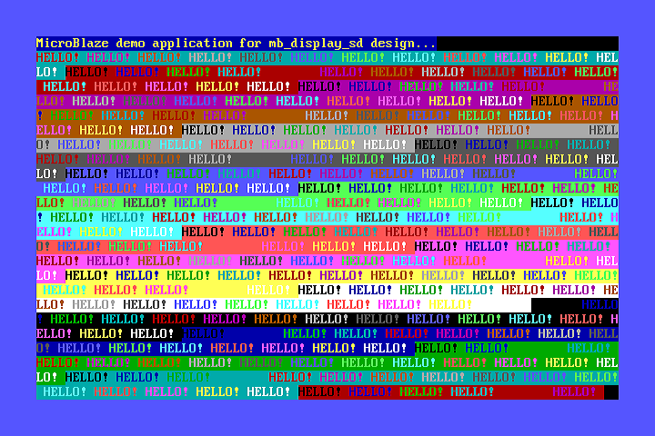
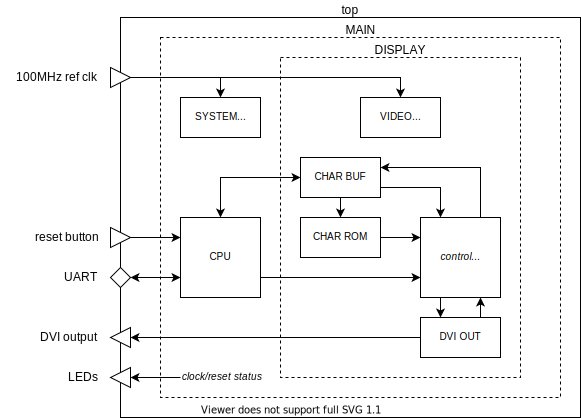

= mb_display_sd

This design combines a MicroBlaze CPU with a standard definition text display, similar to the text modes of a PC VGA adapter.

Two display modes are supported:

* 720x480i60 - 80 x 25 characters
* 720x576i50 - 80 x 32 characters

The text is held in a character buffer RAM, with 16 bits per character. The lower 8 bits hold the character code, and the upper 8 bits hold the background and foreground colour attributes. The 16 colour CGA palette is used. The border colour may also be specified.

8 x 16 pixel character patterns are used, and the character set is the well known link:https://en.wikipedia.org/wiki/Code_page_437[code page 437].

A demonstration MicroBlaze application is provided. This includes a minimal `printf` implementation (credit to link:https://github.com/cjlano/tinyprintf[Kustaa Nyholm / SpareTimeLabs]), and character attribute control.

== Getting Started

The following instructions apply to Windows 10, and require Xilinx Vivado and Vitis version 2020.1 or later to be installed.

To create the Vivado and Vitis projects, and build the FPGA bitstream:

. Open a Windows command prompt, and change directory to the location of the repository files.
. Run the `settings64` batch file from the Xilinx Vitis installation - if required - to set up your path for the Xilinx command line tools. For example:

  C:\> C:\Xilinx\Vitis\2020.1\settings64.bat

. Run the `xbuild` batch file, specifying the design name and board name as arguments, to create Vivado and Vitis projects in the `xproj` directory, and to build an FPGA bitstream. The number of parallel jobs to be used during compilation by Vivado may also be specified on the command line; this defaults to 1 if not specified. For example:

  C:\> cd \work\tyto_project
  C:\work\tyto_project> xbuild.bat mb_display_sd nexys_video 8

After the build process has completed, the Vivado and Vitis projects may be opened in their respective IDEs.

To program the bitstream into a Nexys Video board:

. With the power off, connect the Nexys Video board's *PROG* port to the host PC and its *HDMI OUT* port to the monitor.
. Power on the Nexys Video board.
. Run the `xprog` batch file, specifying the design name and board name as arguments. For example:

  C:\work\tyto_project> xprog.bat mb_display_sd nexys_video

The monitor should display the image shown in Figure 1 above.

== Design Description

The diagram below shows the main design blocks:

The modules shown are described below:

top:: A board specific wrapper around the main design.

MAIN:: The main design.

SYSTEM_CLOCK:: An MMCM configured to generate a 100MHz system clock from a 100MHz reference.

CPU:: Automatically generated wrapper for a Xilinx Block Diagram that contains the MicroBlaze CPU subsystem. Refer to the *MicroBlaze CPU Subsystem* section below for further details.

DISPLAY:: Top level of the display related portion of the design. Includes logic to convert the active pixel X/Y provided by the `dvi_out` module into addresses for the character buffer and character ROM, and a shift register to serialise the character ROM data.

VIDEO_CLOCK:: Fixed frequency pixel (27MHz) and serialiser (135MHz) clock synthesiser (MMCM).

CHAR_BUF:: Character buffer: a dual port RAM with independant 16-bit video and 32-bit CPU ports.

CHAR_ROM:: Synchronous character ROM. The VHDL for this is automatically generated from a BMP file by the `char_rom.py` Python script.

DVI_OUT:: Top level of the DVI output module; refer to the *DVI Output Subsystem* section below for further details.

=== DVI Output Subsystem

The dvi_out module comprises the following:

TIMING:: Counters and logic to synthesise basic video timing.

ENCODER:: Uses the DVI specification's recipe to convert control signals and pixel data into 10-bit TMDS symbols.

SERIALISER:: Converts the TMDS symbol stream from parallel to serial for each DVI output channel, and is also used to generate a DVI (pixel) clock. Drives out via SelectIO (TMDS differential) buffers.

=== MicroBlaze CPU Subsystem

The MicroBlaze CPU is instantiated within a Xilinx Block Diagram file:

image::./microblaze.svg[title="MicroBlaze CPU subsystem.",align="center"]

The blocks are described below:

cpu:: MicroBlaze CPU, 32 bit, microcontroller preset, no caches.

ram:: 64kBytes for CPU instructions and data.

interconnect:: AXI interconnect to allow the CPU AXI master to connect to 3 AXI slaves.

gpio:: AXI GPIO IP core, configured for 2 channels: 8 outputs on the first channel, 8 inputs on the second.

uart:: "Lite" UART IP core, fixed at 115200N81, to provide console I/O (not used in this design).

bram:: Bridges from an AXI Slave to an external block RAM port.

rstctrl:: Reset controller IP core.

debug:: CPU debug controller IP core.

If you alter the block diagram in Vivado, you will need to export a TCL script to recreate by entering the following command in the TCL Console:

 write_bd_tcl -force -include_layout ../../../src/fpga/dsn/mb_display_sd/microblaze.tcl
 
To update the documentation, export an SVG image by entering the following command in the TCL Console:

 write_bd_layout ‑force ‑format svg ../../../doc/mb_display_sd/microblaze.svg

== MicroBlaze Software

The application initialises the display, prints a banner, and then fills the rest of the screen with coloured messages.

=== Source Files

`main.c`:: The top level of the application.

`printf.c`, `printf.h`:: Small memory footprint `printf()` implementation.

`vdu.c`, `vdu.h`:: Text display (Video Display Unit) driver.

`peekpoke.h`:: Macros to access memory and registers.

=== Build

The Vitis software project builds ELF files to run on the CPU. There are two configurations: `Debug` and `Release`. In the `Debug` configuration, the `BUILD_CONFIG_DEBUG` symbol is defined and may be used for conditional compilation. The `Release` ELF file is used to build the FPGA bitstream and runs on the hardware. The `Debug` ELF file is used for simulation.

In this design, the `Debug` and `Release` configurations are identical.

== Simulation

A simulation testbench (`tb_mb_display_sd_nexys_video.vhd`) is provided as part of the Vivado project. This captures the video output to a BMP file. Note that simulation run times are substantial.

++++

++++