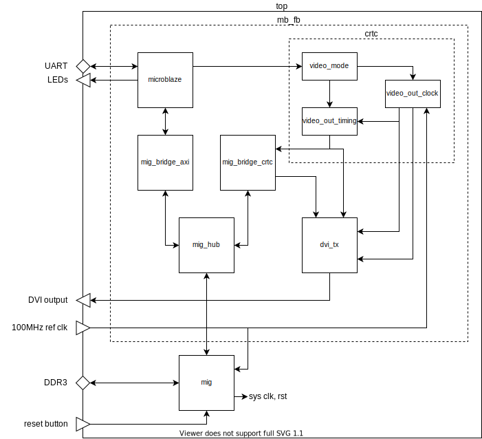
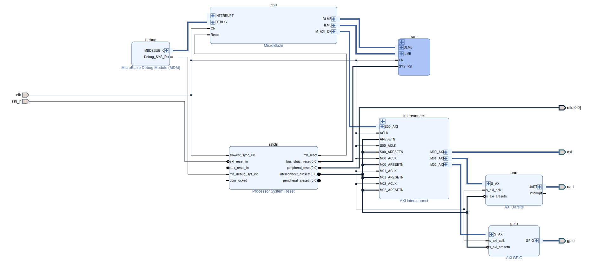

= mb_fb

This design combines a MicroBlaze CPU with a graphics frame buffer, and supports a variety of display resolutions from 640x480 to 1920x1080. The display colour depth is 24 bits (RGB).

Supported boards: *Digilent Nexys Video* and *QMTECH Wukong*.

The frame buffer is held in DDR3 SDRAM and the design uses a simple arbiter to share access to the DDR3 IP core's user interface between the CPU and the display controller, with priority going to the display.

A simple MicroBlaze demo application is included, based on link:https://github.com/tuupola/hagl[Mike Tuupola's *hagl* graphics library].

== Build Procedure

The following instructions apply to Windows 10, and require Xilinx Vivado and Vitis version 2020.x.

To create the Vivado and Vitis projects, and build the FPGA bitstream:

. Open a Windows command prompt, and change directory to the location of the repository files.
. Run the `settings64` batch file from the Xilinx Vitis installation - if required - to set up your path for the Xilinx command line tools. For example:

  C:\> C:\Xilinx\Vitis\2020.1\settings64.bat

. Run the `xbuild` batch file, specifying the design name (`mb_fb`) and board name (`nexys_video` or `qmtech_wukong`) as arguments, to create Vivado and Vitis projects in the `xproj` directory, and to build an FPGA bitstream. The number of parallel jobs to be used during compilation by Vivado may also be specified on the command line; this defaults to 1 if not specified. For example:

  C:\> cd \work\tyto_project
  C:\work\tyto_project> xbuild.bat mb_fb nexys_video 8

After the build process has completed, the Vivado and Vitis projects may be opened in their respective IDEs.

== Programming Procedure

First, ensure that the FPGA board is correctly connected to the host PC and the display monitor as follows:

Digilent Nexys Video:: Connect the *PROG* port to the host PC and the *HDMI OUT* port to the monitor.

QMTECH Wukong:: Connect *J1* to a suitable JTAG programmer (e.g. https://reference.digilentinc.com/reference/programmers/jtag-hs2/start[Digilent JTAG-HS2]) and *P3* to the monitor.

To program the bitstream into the board, run the `xprog` batch file, specifying the design name and board name as arguments. For example:

  C:\work\tyto_project> xprog.bat mb_fb nexys_video

When the programming process has completed, the monitor should display an image.

== Design Description

The diagram below shows the main design blocks:

The modules shown are described below:

top:: A board specific wrapper around the main design and the DDR3 controller IP core.

mig:: Board specific DDR3 controller IP core, produced by Xilinx Memory Interface Generator (MIG).

mb_fb:: Top level of main design.

microblaze:: A Xilinx Block Diagram - see the *MicroBlaze CPU Subsystem* section below for further details.

mig_bridge_axi:: Bridges from CPU's AXI bus master to the the MIG user interface.

crtc:: Video clocking and timing control. The name is a throwback to the Cathode Ray Tube Controllers used in 80s and 90s era home computers.

mig_bridge_crtc:: Drives MIG user interface to fetch pixels from memory as required by CRTC.

mig_hub:: A priority arbiter to share access to the DDR3 controller's user interface between multiple masters.

dvi_tx:: Contains TMDS encoders and serialisers to drive a DVI display monitor.

=== MicroBlaze CPU Subsystem

The MicroBlaze CPU is instantiated within a Xilinx Block Diagram file:

The blocks are described below:

cpu:: MicroBlaze CPU, 32 bit, microcontroller preset, no caches.

ram:: 64kBytes for CPU instructions and data.

interconnect:: AXI interconnect to allow the CPU AXI master to connect to 3 AXI slaves.

gpio:: AXI GPIO IP core, configured for 2 channels: 8 outputs on the first channel, 8 inputs on the second.

uart:: "Lite" UART IP core, fixed at 115200N81, to provide console I/O (not used in this design).

rstctrl:: Reset controller IP core.

debug:: CPU debug controller IP core.

If you alter the block diagram in Vivado, you will need to export a TCL script to recreate by entering the following command in the TCL Console:

 write_bd_tcl -force -include_layout ../../../src/fpga/dsn/mb_fb/microblaze.tcl
 
To update the documentation, export an SVG image by entering the following command in the TCL Console:

 write_bd_layout ‑force ‑format svg ../../../doc/mb_fb/microblaze.svg

== MicroBlaze Software

The application initialises the display, prints a banner, and then fills the rest of the screen with coloured messages.

=== Source Files

`main.c`:: The top level of the application.

`printf.c`, `printf.h`:: Small memory footprint `printf()` implementation.

`vdu.c`, `vdu.h`:: Text display (Video Display Unit) driver.

`peekpoke.h`:: Macros to access memory and registers.

=== Build

The Vitis software project builds ELF files to run on the CPU. There are two configurations: `Debug` and `Release`. In the `Debug` configuration, the `BUILD_CONFIG_DEBUG` symbol is defined and may be used for conditional compilation. The `Release` ELF file is used to build the FPGA bitstream and runs on the hardware. The `Debug` ELF file is used for simulation.

In this design, the `Debug` and `Release` configurations are identical.

== Simulation

A simulation testbench is provided as part of the Vivado project. This captures the video output to a BMP file. Note that simulation run times are substantial.

++++

++++